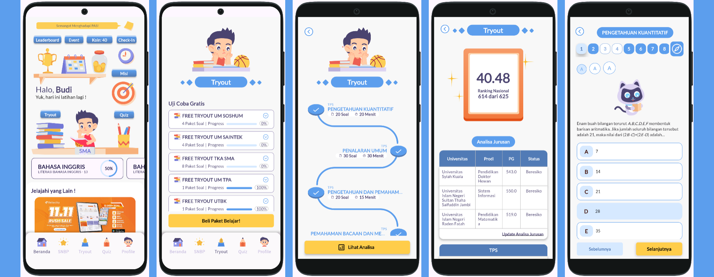
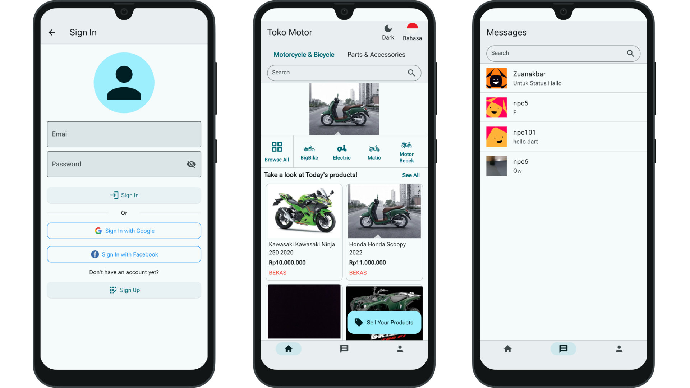
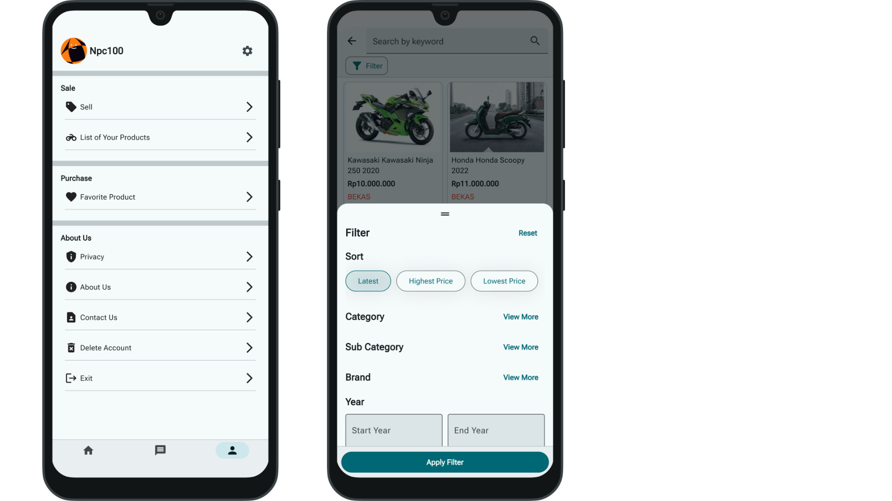
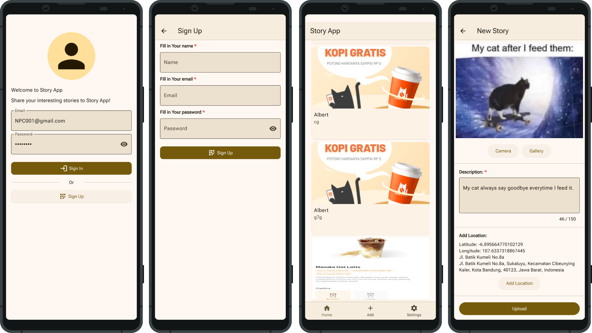
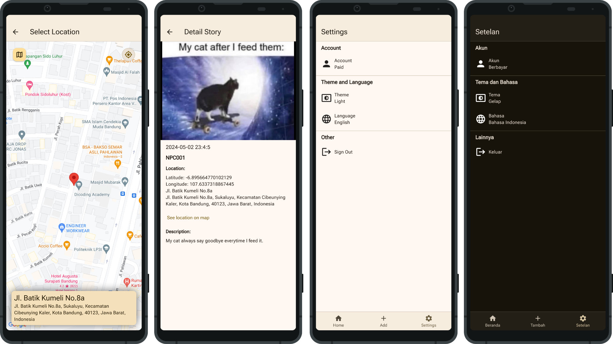

# Mobile Developer | Building Cost-Effective & Scalable Apps | Educational Tech

[English] Synthesizing the gap between User Experience, Business Goals, and Technical Constraints.

I focus on delivering digital solutions that are cost-effective, efficient, and impactful. My approach solves problems by finding the perfect balance—preventing both overengineering and underengineering.

Open to feedback, discussion, and collaborative iteration.

[Bahasa Indonesia] Menyintesis kebutuhan Pengguna, Bisnis, dan Teknis.

Saya fokus memastikan solusi digital (perangkat lunak) yang dibangun efisien secara biaya, efektif, dan berdampak nyata. Saya menyelesaikan masalah dengan pertimbangan matang: mencegah terjadinya Overengineering maupun Underengineering.

Terbuka terhadap diskusi, umpan balik, dan proses iterasi.

Contact: [LinkedIn](https://www.linkedin.com/in/irfan-muhammad-faisal-359665148/).

## Project
Mengenai project yang pernah saya buat, di antaranya yaitu:

- 
  Flutter:
  + Velocity Try Out
    

      
Preview

      
      
      ### Deskripsi

      Ini merupakan aplikasi pendidikan yang membantu siswa belajar dengan menyediakan soal-soal berkualitas untuk menguji kemampuan dan sebagai tempat berlatih 

      Download aplikasi ini di:
      - [Play Store](https://play.google.com/store/apps/details?id=com.edu.velocity&hl=id)
      - App Store (Sudah lolos <i>apple review</i> tapi kami masih mempertimbangkan detailnya)

       Dalam proses pengerjaannya:
      + Menyintesis kebutuhan Pengguna, Bisnis, dan Teknis.
      + Berupaya mencari solusi yang efisien, efektif, mencegah terjadinya Overengineering dan Underengineering.
      + Sering berdiskusi sebelum mengambil keputusan langkah berikutnya.
      + Berdiskusi saat proses perancangan UI.
      + Banyak dinamika situasi yang terjadi, namun tetap beradaptasi dengan baik.
      + Banyak pelajaran berharga yang didapatkan dari kerja tim, selama proses pengerjaan ini.
      + State management menggunakan GetX
      + Menggunakan API untuk berinteraksi dengan server. Juga membuat API Contract.
      + Terdapat penggunaan Firebase.
    

  + E-Commerce
    

      
Preview

      
      
      
      ### Deskripsi

      Ini merupakan aplikasi jual beli motor, beserta komponen atau barang yang berkaitan. 
      Aplikasi ini masih dalam proses pengembangan, dan belum rilis. Nama aplikasi pada foto hanya contoh. 
      Aplikasi ini ditargetkan akan rilis pada android dan iOS 

      Dalam proses pengerjaannya:
      + Menyintesis kebutuhan Pengguna, Bisnis, dan Teknis.
      + Berupaya mencari solusi yang efisien, efektif, mencegah terjadinya Overengineering dan Underengineering.
      + Sering berdiskusi sebelum mengambil keputusan langkah berikutnya.
      + Berdiskusi saat proses perancangan UI.
      + Banyak hal menarik yang terjadi selama proses pengembangan secara tim.
      + State management menggunakan Provider
      + Aplikasi menggunakan API untuk berinteraksi dengan server
      + Terdapat penggunaan Firebase, Pusher, dan OneSignal.
      + Terdapat Localization: terdiri dari Bahasa Indonesia dan English
    

  + StoryApp
    

      
Preview

      
      
      
      ### Deskripsi

      Ini merupakan aplikasi berbagi cerita. Project flutter ini ditujukan untuk Android, iOS, dan Web. Ini tidak rilis di mana pun karena hanya untuk contoh. 
      
      Dalam proses pengerjaanya:
      + Dari sisi layout terdapat penerapan [Sliver](https://docs.flutter.dev/ui/layout/scrolling/slivers), [Expanded](https://api.flutter.dev/flutter/widgets/Expanded-class.html), [Flexible](https://api.flutter.dev/flutter/widgets/Flexible-class.html), dan [Gap](https://pub.dev/packages/gap)
      + Dari sisi navigasi telah menerapkan navigasi 2.0 (declarative style) menggunakan library [go_router](https://pub.dev/packages/go_router)
      + Dari sisi tema terdapat penerapan [Material Design 3](https://m3.material.io/) dan [Cupertino (iOS-style)](https://docs.flutter.dev/ui/widgets/cupertino])
      + Dari sisi cara eksekusi kode program terdapat penerapan [Asynchronous](https://dart.dev/codelabs/async-await)
      + Dari sisi state management terdapat penerapan library [provider](https://pub.dev/packages/provider)
      + Dari sisi request API terdapat penerapan library [http](https://pub.dev/packages/http)
      + Dari sisi JSON Serialization terdapat penerapan library [freezed](https://pub.dev/packages/freezed)
      + Dari sisi Local Memory terdapat penggunaan [shared_preferences](https://pub.dev/packages/shared_preferences)
      + Dari sisi menampilkan daftar data (daftar produk) dalam bentuk list/grid terdapat penerapan pagination
      + Dari sisi UI Advance terdapat penggunaan [Custom Painter](https://api.flutter.dev/flutter/rendering/CustomPainter-class.html) dan [Explicit Animation](https://docs.flutter.dev/ui/animations/tutorial)
      + Dari sisi [Localization](https://docs.flutter.dev/ui/accessibility-and-internationalization/internationalization) terdaoat Bahasa Indonesia dan English
      + Dari sisi [Build Variant (Flavors)](https://docs.flutter.dev/deployment/flavors) terdapat flavor free dan paid
    

- 
  
  Android (Kotlin):
  + [D'Tonton](https://github.com/IrfanKnowledge/d_tonton/tree/v1.2.0)
    
    ### Deskripsi
  
    Ini merupakan aplikasi daftar film dari API Open Source. Ini tidak rilis di mana pun karena hanya untuk contoh. 

- 
  Back End NodeJS (Hapi.js):
  + [BookShelfAPI](https://github.com/IrfanKnowledge/sbm-1-bookshelf-api)

    ### Deskripsi
  
    Ini merupakan API Service untuk peminjaman buku. Ini tidak rilis di mana pun karena hanya untuk contoh. 

- 
  PHP (html, css, javascript):
  + [E-Learning](https://github.com/IrfanKnowledge/PromNet_E-Learning)

    ### Deskripsi
  
    Ini merupakan E-Learning untuk membantu guru dan siswa belajar. Ini bisa digunakan untuk internal sekolah. 

## Github Statistic

